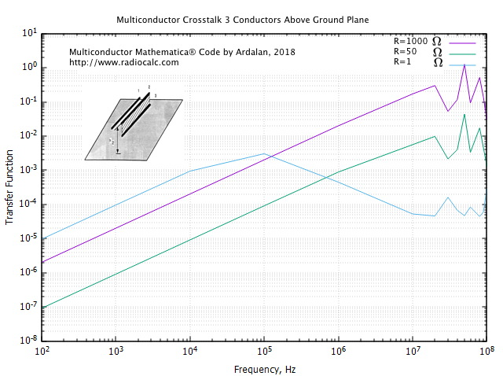
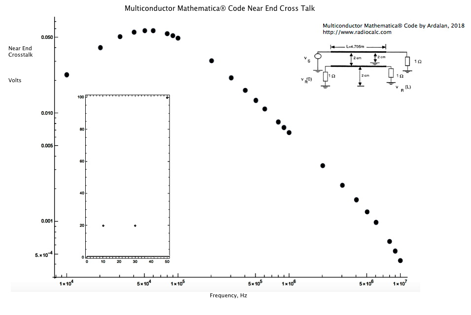

# Multiconductor Modeling Analysis
Open Source Mathematica® Code Multiconductor Modeling and Analysis
Visit <a href="https://www.RadioCalc.com">RadioCalc</a>.

Note: HTML links to Code for reference. Always run the Mathematica&reg; Notebook (.nb). Click on Notebook link then download.

 In this work we will present Mathematica ® code for Modeling Multiconductor Transmission Lines. The Code is Written by Dr. Sasan Ardalan. The work is based on Research at NC State by Professor Sasan Ardalan, Mike Riddle and John Suh ( Both Masters Electrical Engineering) while at NC State University (1988).
The paper also has simulation results that match very closely with experimental results presented by the late Professor Clayton Paul. Professor Clayton Paul did fundamental work in Multiconductor Transmission Lines and the Derivation of Per Unit Parameters. See his book on the Analysis of Multconductor Transmission Lines.

 <h1 >Open Source Mathematica &reg; Code Multiconductor Modeling and Analysis    </h1>
    
&nbsp;

    <table width="1135" border="1">
      <tbody>
        <tr>
          <th width="47" scope="col">
Case
</th>
          <th width="484" scope="col">Description</th>
          <th width="87" scope="col">Code</th>
          <th width="81" scope="col">WEB View</th>
          <th width="258" scope="col">Result Plots</th>
        </tr>
        <tr>
          <td>
1
</td>
          <td>Code for Three Conductors Above Ground Plane Based on Report Analyzing Crosstalk Reduction</td>
          <td><a href="Mathematica_NoteBooks/Multconductor_PerUnitLengthParallelAboveGround_Straight_Inductance_Reduction_CrossTalk.nb">Notebook</a></td>
          <td><a href="https://www.radiocalc.com/MultiConductorCAD/Mathematica_WEB_Views/Multconductor_PerUnitLengthParallelAboveGround_Straight_Inductance_Reduction_CrossTalk/Multconductor_PerUnitLengthParallelAboveGround_Straight_Inductance_Reduction_CrossTalk.htm">HTML</a></td>
          <td>
<a href="multiconductor_3_above_ground_plane.jpg">Three Simulations Various Loads</a>(Far End)

          
Obtained using Gnuplot from Mathematica&reg; Results. <a href="multicond_two_wire_straight_receptor_fec_mathematica.txt">Raw Data</a>, GnuPlot <a href="freq_transfer_3_column.gp">Script</a>
</td>
        </tr>
        <tr>
          <td>
2
</td>
          <td>Code for Three Conductors Above Ground Plane Based on Report  Near End Cross Talk Two Conductors.</td>
          <td><a href="Mathematica_NoteBooks/Multconductor_PerUnitLengthParallelAboveGround_Crosstalk_Two_Conductors.nb">Notebook</a></td>
          <td><a href="https://www.radiocalc.com/MultiConductorCAD/Mathematica_WEB_Views/Multconductor_PerUnitLengthParallelAboveGround_Crosstalk_Two_Conductors/Multconductor_PerUnitLengthParallelAboveGround_Crosstalk_Two_Conductors.htm">HTML</a></td>
          <td><a href="Results_Two_Conductor_Crosstalk2.jpg">Crosstalk Two Conductors</a> (Near End)</td>
        </tr>
        <tr>
          <td>

</td>
          <td>&nbsp;</td>
          <td>&nbsp;</td>
          <td>&nbsp;</td>
          <td>&nbsp;</td>
        </tr>
      </tbody>
    </table>
     
  <h2 align="center" > Case 1</h2>
    

    
Case 2

    

    
&nbsp;

    
&nbsp;

 

<a href="http://www.silicondsp.com">Silicon DSP Corporation </a>

<a href="http://www.radiocalc.com">RadioCalc </a>

